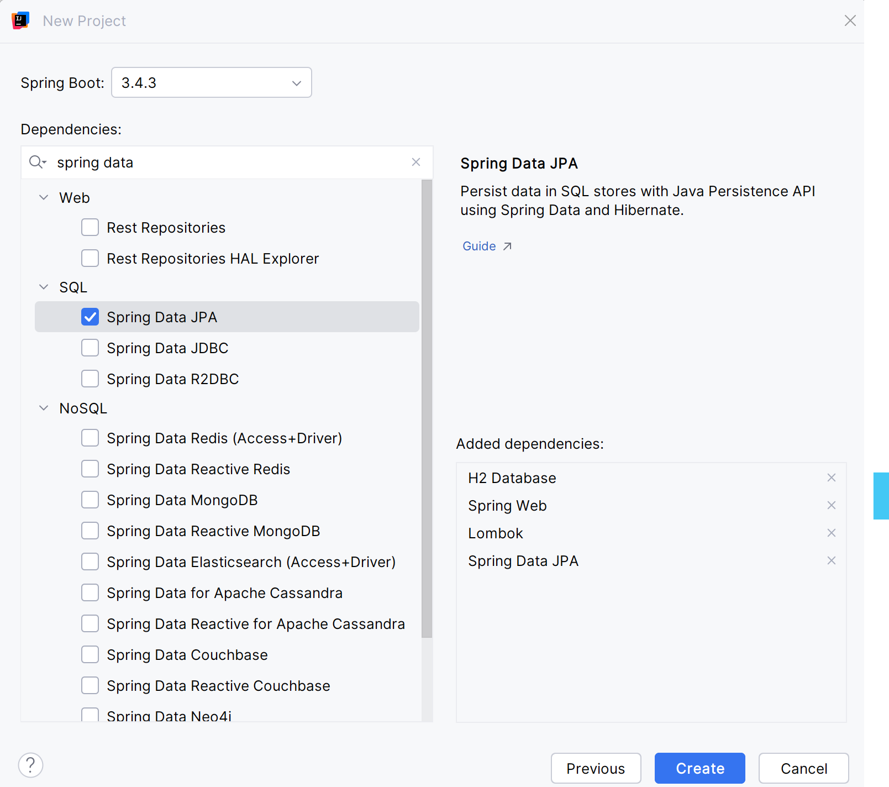
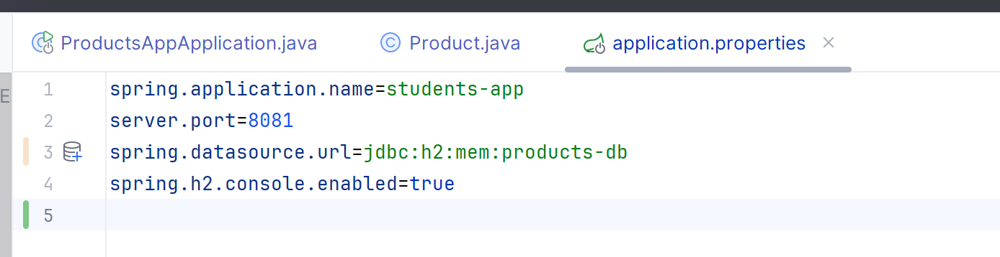
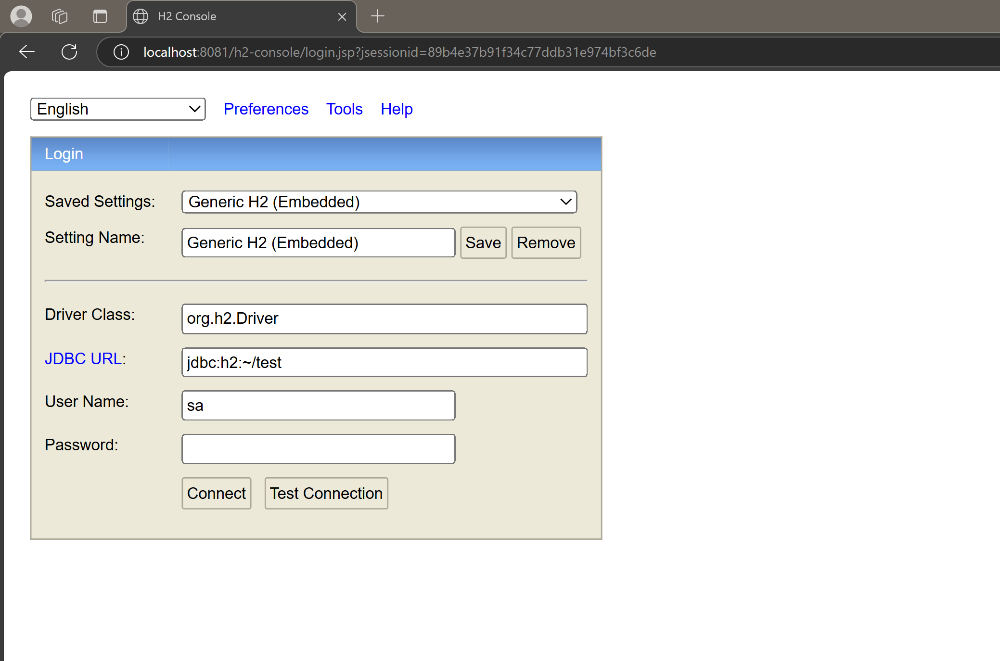
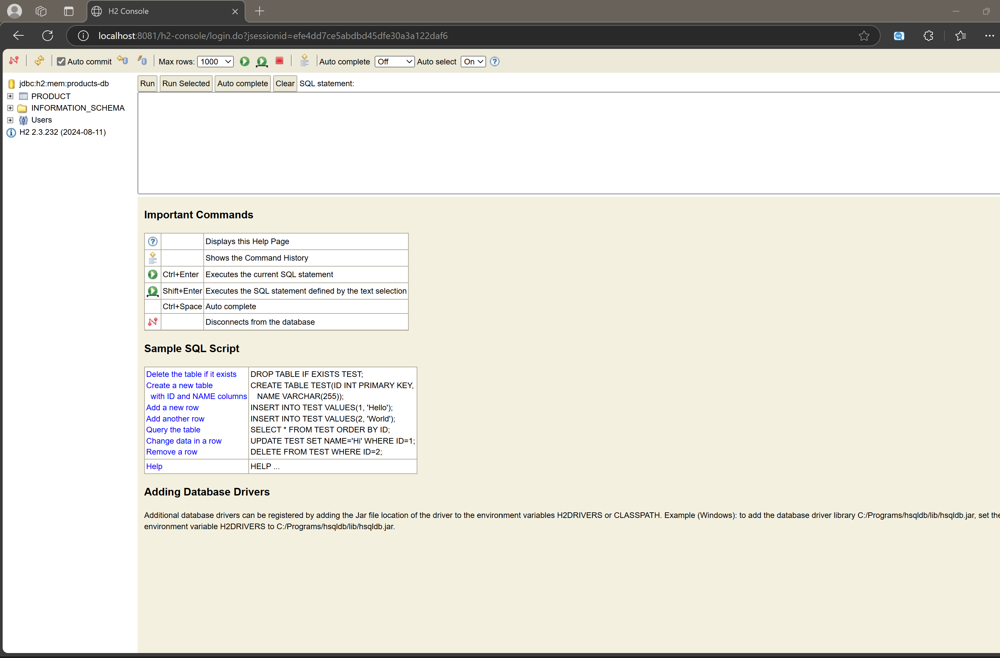

# First-Spring-Boot-App-Spring-Data-JPA
on utilisant les ORM JPA Hibernate Spring Data
tout d'abord on crée un projet spring boot :
il faut choisir le type de build il devrait etre maven 
il est préférable aussi d'utiliser Installer IntelliJ Ultimate comme ide 
java 17 qui utiliser dans ce projet 
3.4.3 la version de spring boot dans ce projet 
il faut aussi faire les dépendances suivantes : les dépendances JPA, H2, Spring Web et Lombock
src/main/resources/images/

pour le properties il faut faire ceci 

on peut accéder à la console de h2 via http://localhost:8081/h2-console

on écrit le jdbc:h2:mem:products-db dans jdbc-url de h2 console on va voir la classe product qu'on a fait 

