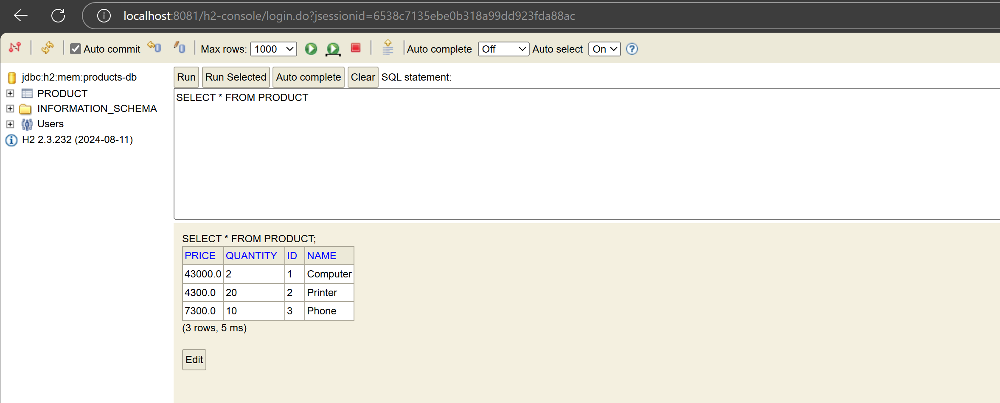

# First Spring Boot App with Spring Data JPA

Ce projet est une application Spring Boot qui utilise les ORM JPA, Hibernate et Spring Data pour gérer une base de données de produits.

---

## **Configuration du projet**

### **1. Création du projet Spring Boot**
- Utilisez **Maven** comme outil de build.
- Utilisez **IntelliJ Ultimate** comme IDE.
- Version de Java : **Java 17**.
- Version de Spring Boot : **3.4.3**.

---

### **2. Dépendances nécessaires**
Ajoutez les dépendances suivantes dans votre fichier `pom.xml` :

- **Spring Data JPA** : Pour la gestion des données avec JPA.
- **H2 Database** : Pour une base de données en mémoire (utilisée pour le développement).
- **Spring Web** : Pour créer des endpoints REST.
- **Lombok** : Pour simplifier le code avec des annotations.

Exemple de configuration des dépendances dans `pom.xml` :

```xml
<dependencies>
    <!-- Spring Data JPA -->
    <dependency>
        <groupId>org.springframework.boot</groupId>
        <artifactId>spring-boot-starter-data-jpa</artifactId>
    </dependency>

    <!-- H2 Database -->
    <dependency>
        <groupId>com.h2database</groupId>
        <artifactId>h2</artifactId>
        <scope>runtime</scope>
    </dependency>

    <!-- Spring Web -->
    <dependency>
        <groupId>org.springframework.boot</groupId>
        <artifactId>spring-boot-starter-web</artifactId>
    </dependency>

    <!-- Lombok -->
    <dependency>
        <groupId>org.projectlombok</groupId>
        <artifactId>lombok</artifactId>
        <scope>provided</scope>
    </dependency>
</dependencies>
```

---

### **3. Configuration de application.properties**

Nous avons configuré la base de données pour utiliser au lieu de **H2**.

```properties
spring.application.name=product-app
server.port=8081
spring.datasource.url=jdbc:h2:mem:products-db
spring.h2.console.enabled=true
spring.jpa.show-sql=true
```

Nous avons configuré la base de données pour utiliser **MySQL**.

```properties
spring.application.name=product-app
server.port=8081

spring.datasource.url=jdbc:mysql://localhost:3306/products-db?createDatabaseIfNotExist=true
spring.datasource.username=root
spring.datasource.password=
spring.jpa.hibernate.ddl-auto=update
spring.jpa.properties.hibernate.dialect=org.hibernate.dialect.MariaDBDialect

```

---

### **4. Structure du projet**

#### **1. Entité Product**
Créez une entité `Product` pour représenter un produit dans la base de données.

```java
package org.example.productapp.entities;

import jakarta.persistence.Entity;
import jakarta.persistence.GeneratedValue;
import jakarta.persistence.GenerationType;
import jakarta.persistence.Id;
import lombok.AllArgsConstructor;
import lombok.Data;
import lombok.NoArgsConstructor;

@Entity
@Data
@NoArgsConstructor
@AllArgsConstructor
public class Product {
    @Id
    @GeneratedValue(strategy = GenerationType.IDENTITY)
    private Long id;
    private String name;
    private Double price;
    private Integer quantity;
}
```

#### **2. Repository ProductRepository**
Créez un repository pour gérer les opérations CRUD sur l'entité `Product`.

```java
package org.example.productapp.repository;

import org.example.productapp.entities.Product;
import org.springframework.data.jpa.repository.JpaRepository;
import java.util.List;

public interface ProductRepository extends JpaRepository<Product, Long> {
    List<Product> findByNameContains(String name);
}
```

#### **3. Endpoint REST**
Créez un contrôleur pour exposer les produits via un endpoint REST.

```java
package org.example.productapp.controller;

import org.example.productapp.entities.Product;
import org.example.productapp.repository.ProductRepository;
import org.springframework.beans.factory.annotation.Autowired;
import org.springframework.web.bind.annotation.GetMapping;
import org.springframework.web.bind.annotation.RequestMapping;
import org.springframework.web.bind.annotation.RestController;

import java.util.List;

@RestController
@RequestMapping("/products")
public class ProductController {

    @Autowired
    private ProductRepository productRepository;

    @GetMapping
    public List<Product> getAllProducts() {
        return productRepository.findAll();
    }
}
```

---

### **5. Utilisation de l'application**

Démarrez l'application Spring Boot.

Accédez à la liste des produits au format JSON via :

**➡️ http://localhost:8081/products**

---

### **6. Exemples de sortie**

#### **1. Table Product dans la console H2**


#### **2. Liste des produits au format JSON**
Si on accéde à la page http://localhost:8081/products on doit voir comme ceci 
```json
[
    {
        "id": 1,
        "name": "Computer",
        "price": 43000.0,
        "quantity": 2
    },
    {
        "id": 2,
        "name": "Printer",
        "price": 4300.0,
        "quantity": 20
    },
    {
        "id": 3,
        "name": "Phone",
        "price": 7300.0,
        "quantity": 10
    }
]
```

---

### **7. Conclusion**
Ce projet est un exemple simple d'une application Spring Boot utilisant Spring Data JPA et Hibernate pour gérer une base de données de produits. Vous pouvez étendre ce projet en ajoutant plus de fonctionnalités, comme la gestion des commandes, des utilisateurs, etc.

